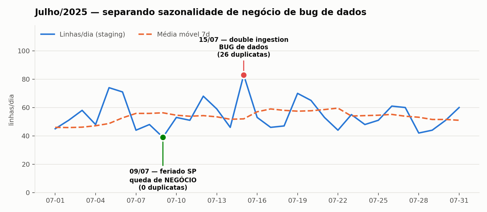
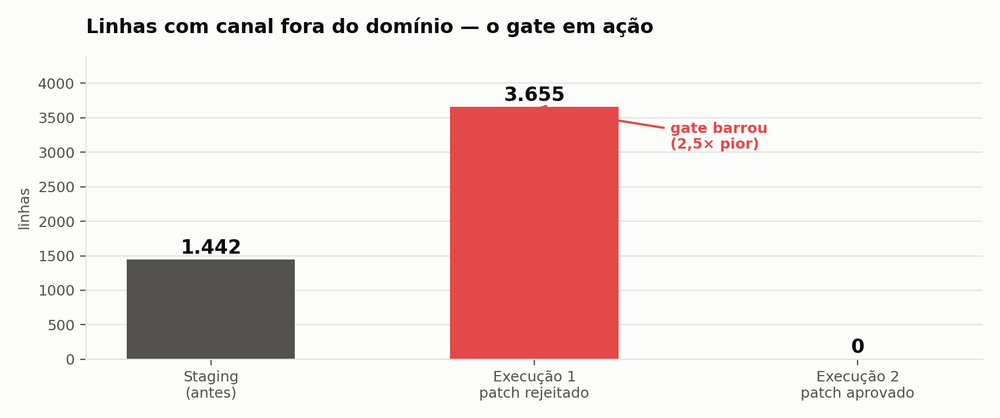

# Agentic Data Quality Workflow

> Um time de agentes de IA atua como SRE de dados: detecta problemas numa tabela de vendas, **distingue queda legítima de negócio de bug de pipeline**, escreve o SQL de correção, mede o impacto em sandbox e só materializa após aprovação humana.

`LangChain` · `CrewAI` · `DuckDB` · `OpenAI` · `Python 3.12+`

---

## O problema que o projeto resolve

Uma tabela de vendas diárias apresenta dois eventos em julho:

| Dia | Movimento | O que é |
|---|---|---|
| **09/07** | −30,7% vs. média móvel de 7 dias | **Negócio** — feriado estadual em SP |
| **15/07** | +59,6% vs. média móvel de 7 dias | **Bug** — 26 pedidos ingeridos em duplicidade |

Os dois parecem anomalia. Um agente afobado "corrige" ambos e, ao fazê-lo, apaga um fato real do negócio.

**O discriminante não é o volume — é a duplicidade.** Em 09/07 há 39 linhas e 39 pedidos distintos: menos vendas, dados íntegros. Em 15/07 há 83 linhas e apenas 57 pedidos: mais linhas, mesmos pedidos.



O agente analista não estima esses números — ele consulta uma ferramenta que os calcula no banco.

---

## O achado: SQL válido, resultado destrutivo

Na primeira execução, o agente de engenharia gerou um patch que **executou sem um único erro** e teria anulado o campo de canal em 3.675 linhas válidas.

```sql
CASE WHEN channel_norm IN ('store', 'on_line', 'market_place') THEN <mapeia certo>
     ELSE NULL END
```

Ele tratou apenas os três rótulos **errados** e mandou o complemento para `NULL` — e o complemento eram justamente os rótulos **certos** (`online`, `in_store`, `marketplace`).



**Por que as camadas anteriores não pegaram:**

- guardrails estáticos — não há comando proibido nem coluna inexistente;
- dry-run — o SQL compila e executa perfeitamente, o erro é de lógica;
- validação por LLM — o modelo que escreve o `CASE` invertido é o que o lê como correto.

Só o **gate quantitativo** pegou, porque ele não pergunta se o SQL está bem escrito. Pergunta *quantas linhas ficaram fora do domínio depois*. Decisão automática: `NECESSITA REVISÃO`. A camada gold não foi tocada.

A causa raiz estava no prompt: um parêntese escrito para ajudar ("atenção: existem os rótulos `store`, `on_line` e `market_place`") virou, para o modelo, o universo de entrada. Substituído pelo mapeamento completo, a reexecução passou nos cinco gates.

---

## Arquitetura

```
CSV → raw.sales ──→ stg.sales ──crew──→ dry-run (sandbox) ──aprovação──→ gold.sales_clean
                        │                     │                              │
                   checks.py            guardrails + gates              snapshot + RCA
```

| # | Agente | Entrega | Ferramentas |
|---|---|---|---|
| T0 | Orchestrator | `plan.json` | — |
| T1 | Analyst | `analysis_findings.json` | baseline · query read-only · sazonalidade · canais |
| T2 | DataEngineer | `patch.sql` | baseline · query · validar SQL · dry-run |
| T3 | Validator | `validation_report.json` | validar SQL · dry-run |
| T4 | Reviewer | `RCA_report.md` | — |

**Quatro camadas de contenção**, independentes entre si:

1. **Guardrails estáticos** — bloqueiam `DROP`/`ALTER`/`UPDATE`/`DELETE` em `raw`/`stg`, exigem `CREATE OR REPLACE` + `ROW_NUMBER()`, detectam colunas inexistentes.
2. **Dry-run reversível** — o patch roda contra tabela temporária dentro de transação encerrada com `ROLLBACK`. As métricas são medidas, não estimadas.
3. **Gates de aceite** — duplicatas zeradas · P99 não aumenta · canal no domínio · `customer_id` não inventado · perda de linhas ≤ 20%.
4. **Aprovação humana** — `REQUIRE_HUMAN_APPROVAL=True`. Nada chega em `gold` sem comando explícito.

---

## Resultado medido

| Métrica | BEFORE (`stg.sales`) | AFTER (`gold.sales_clean`) |
|---|---:|---:|
| Linhas | 5.117 | 5.091 |
| Duplicatas por (order_id, data) | 26 | **0** |
| `unit_price` ≤ 0 ou nulo | 51 | **0** |
| Linhas com canal fora do domínio | 1.442 | **0** |
| Rótulos distintos de canal | 6 | **3** |
| `customer_id` ausente | 88 | 88 *(preservado)* |

Perda de linhas: **0,51%** — exatamente as 26 duplicatas.

O mais importante é o que **não** mudou: as vendas de 09/07 seguem intactas e os 88 registros sem cliente continuam nulos. Corrigiu defeito sem apagar fato.

---

## Como rodar

```bash
git clone https://github.com/Raphael-OCosta/Agentic-data-quality-project.git
cd Agentic-data-quality-project

python -m venv .venv
source .venv/bin/activate           # Windows: .venv\Scripts\activate
pip install -r requirements.txt

cp .env.example .env                # e preencha OPENAI_API_KEY
```

```bash
# pipeline completo (usa a API do LLM — alguns centavos por execução)
python -m src.run_workflow

# trilha determinística, sem custo de LLM
python -m src.run_workflow --skip-crew

# revisar reports/patch.sql e então materializar a gold
python -m src.apply_patch --approve

# RCA gerado das métricas medidas (contra-prova do agente)
python -m src.rca

# 13 checagens, sem API
python -m tests.test_pipeline
```

---

## Decisões de design

**Winsorização em vez de remoção de outliers.** Remover extremos reduz a massa de dados e distorce volume de vendas; limitar ao intervalo `[P01, P99]` preserva a linha e contém o efeito.

**`customer_id` ausente permanece `NULL`.** Imputar criaria dado falso com aparência de dado verdadeiro — o pior resultado possível para análise de recorrência.

**Canal desconhecido vira `NULL`, não bucket-padrão.** Forçar o desconhecido para "online" mascararia o surgimento de um canal novo.

**`ORDER BY` determinístico no `ROW_NUMBER()`.** Sem critério de desempate real, qual duplicata sobrevive fica a critério do motor e o patch deixa de ser reprodutível.

**Fallback auditado.** Se o patch do agente não executa, um patch de referência determinístico assume, o SQL rejeitado é preservado em `reports/patch_agent_rejected.sql` e o acionamento fica registrado.

**RCA determinístico paralelo.** `src/rca.py` monta o relatório a partir das métricas medidas, impedindo que o agente revisor declare aplicada uma correção que não foi.

---

## Estrutura

```
src/
  config.py            flags e caminhos
  ingest.py            raw/stg, parse de datas multiformato
  checks.py            KPIs objetivos → baseline_checks.json
  tools.py             ferramentas dos agentes, guardrails, dry-run
  postprocess.py       sanitização e validação de schema das saídas do LLM
  prompts.py           prompts de sistema por papel
  crew.py              agentes, tasks e DAG
  reference_patch.py   patch determinístico (gabarito/fallback)
  apply_patch.py       portão humano, aplicação, métricas BEFORE/AFTER
  rca.py               RCA determinístico
  figures.py           gráficos
  run_workflow.py      orquestração ponta a ponta
tests/
  test_pipeline.py     13 checagens sem LLM
reports/               artefatos gerados
```

---

## Limitações

- A correção trata o sintoma. A duplicidade continuará chegando enquanto a ingestão não tiver chave idempotente.
- Os gates cobrem o que foi antecipado. O gate de canal existia porque o label drift era um problema conhecido — uma corrupção em campo sem gate correspondente passaria pelas quatro camadas.
- O componente LLM não é reprodutível bit a bit: duas execuções produziram SQL diferente com o mesmo modelo e a mesma temperatura.

---

## Contexto

Projeto prático do Módulo 7 da disciplina **LLM's — Engenharias Avançadas**, de autoria do **Prof. Thiago Azeredo Rodrigues**. O enunciado, o cenário e o dataset didático são material da disciplina. A implementação, os guardrails, os gates de aceite, a camada de testes e a análise documentada aqui são contribuições próprias.

## Licença

MIT — ver [LICENSE](LICENSE).
